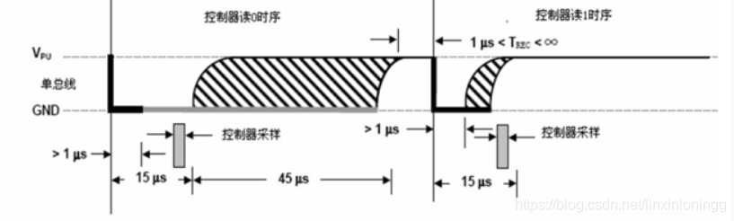

### "51单片机+oled+ds18b20：初始化oled显示

>#### 硬件电路简介
>
>* 0.96寸oled采用iic接口：scl接P1^1;sda接P1^0;vcc接单片机vcc，gnd接单片机gnd
>* ds18b20：dq接P3^6;vcc接单片机vcc，gnd接单片机gnd
>* 单片机内部ledP2^7点亮，显示系统正常运行
>
>#### IIC
>
>由于oled模块是0.96英寸olediic接口的，所以配置oled显示之前，需要先配置好iic
>
>***I2C（Inter－Integrated Circuit）总线开发的两线式串行总线***
>
>I2C 的协议定义了通信的起始和停止信号、数据有效性、响应、仲裁、时钟同步和地址广播等环节
>
>* 数据有效性规定：
>* 起始和停止信号：
>* 应答相应：
>* 应答0或1：
>
>**根据IIC的时序图以及定义封装三个函数：**
>
>本实验用到延时函数：
>
>(延时大约10us)
>
>void Delay10us(void)
>{
>	unsigned char a,b;
>	for(b=1;b>0;b--)
>	{
>	for(a=2;a>0;a--);
>	}
>}
>
>（粗略的延时）
>
>void delay(unsigned char i)
>{
>  while(i--);
>}
>
>1. **起始信号：**
>
> void I2cStart(void)
> {
> 	SDA=1;
> 	Delay10us();
> 	SCL=1;
> 	Delay10us(); 									//建立时间是SDA保持时间大于4.7us
> 	SDA=0;
> 	Delay10us();									//保持时间大于4us
> 	SCL=0;			
> 	Delay10us();		
> }
>
> **2.终止信号：**
>
> void I2cStop(void)
> {
> 	SDA=0;
> 	Delay10us();
> 	SCL=1;
> 	Delay10us();									//建立时间大于4.7us
> 	SDA=1;
> 	Delay10us();		
> }
>
> **3.iic发送单字节的函数**
>
> unsigned char I2cSendByte(unsigned char dat)
> {
>     unsigned char a=0,b=0;				//最大255，一个机器周期为1us，最大延时255us。		
> 	for(a=0;a<8;a++)							//要发送8位，从最高位开始
> 	{
> 		SDA=dat>>7;							//起始信号之后SCL=0，所以可以直接改变SDA信号
> 		dat=dat<<1;
> 		Delay10us();
> 		SCL=1;
> 		Delay10us();//建立时间>4.7us
> 		SCL=0;
> 		Delay10us();//时间大于4us		
> 	}
> 	SDA=1;
> 	Delay10us();
> 	SCL=1;
> 	while(SDA)										//等待应答，也就是等待从设备把SDA拉低
> 	{
> 		b++;
> 		if(b>200)	 								//如果超过2000us没有应答发送失败，或者为非应答，表示接收结束
> 		{
> 			SCL=0;
> 			Delay10us();
> 			return 0;
> 		}
> 	}
> 	SCL=0;
> 	Delay10us();
>  	return 1;		
> }
>
> ~~~
>到此IIC的相关函数封装完毕~~~
> ~~~
>
> #### 配置oled显示相关函数
>
> 图片1
>
> 根据图片所知：器件从地址为0x78
>
> #### 1.封装写操作相关函数
>
> 1.1 写使能函数
>
> void oled_Write_cmd(unsigned char cmd)
> {
> 	I2cStart();
> 	I2cSendByte(0x78);	//发送写器件地址
> 	I2cSendByte(0x00);	//发送要写入内存地址
> 	I2cSendByte(cmd);	//写入命令
> 	I2cStop();
> }
>
> 1.2写字节函数
>
> void oled_Write_data(unsigned char dat)
> {
> 	I2cStart();
> 	I2cSendByte(0x78);//发送写器件地址
> 	I2cSendByte(0x40);//发送要写入内存地址
> 	I2cSendByte(dat);	//写入数据
> 	I2cStop();
> }
>
> #### 2.封装oled初始化函数
>
> 当封装好oled的写操作相关函数之后
>
> 就可封装oled的初始化函数
>
> 2.1 清屏函数
>
> void oled_clear(void) 
> {	unsigned char i,j;
> 	oled_Write_cmd(0x20);
> 	oled_Write_cmd(0x02);
>     for(i=0;i<8;i++)
> 	{
> 	   	oled_Write_cmd(0xb0+i);
> 		oled_Write_cmd(0x00);
> 		oled_Write_cmd(0x10);
> 		for(j=0;j<128;j++)
> 		{
> 		   oled_Write_data(0x00); 
> 		}
> 	}	
> }
>
> 2.2初始化函数
>
> void oled_initial(void)//oled初始化函数
> {
>     delay(500);		 
> 	oled_Write_cmd(0xae);//--turn off oled panel 关闭显示
>     oled_Write_cmd(0x00);//---set low column address设置起始列的低四位 0x0x
>     oled_Write_cmd(0x10);//---set high column address设置起始列的高四位0x1x
>     oled_Write_cmd(0x40);//--set start line address  Set Mapping RAM Display Start Line (0x00~0x3F)
>     oled_Write_cmd(0x81);//--set contrast control register设置对比度
>     oled_Write_cmd(0xff); // Set SEG Output Current Brightness对比度为oxff
>     oled_Write_cmd(0xa1);//--Set SEG/Column Mapping     0xa0左右反置 0xa1正常
>     oled_Write_cmd(0xc8);//Set COM/Row Scan Direction   0xc0上下反置 0xc8正常
>     oled_Write_cmd(0xa6);//--set normal display
>     oled_Write_cmd(0xa8);//--set multiplex ratio(1 to 64)
>     oled_Write_cmd(0x3f);//--1/64 duty
>     oled_Write_cmd(0xd3);//-set display offset    Shift Mapping RAM Counter (0x00~0x3F)
>     oled_Write_cmd(0x00);//-not offset
>     oled_Write_cmd(0xd5);//--set display clock divide ratio/oscillator frequency
>     oled_Write_cmd(0x80);//--set divide ratio, Set Clock as 100 Frames/Sec
>     oled_Write_cmd(0xd9);//--set pre-charge period
>     oled_Write_cmd(0xf1);//Set Pre-Charge as 15 Clocks & Discharge as 1 Clock
>     oled_Write_cmd(0xda);//--set com pins hardware configuration
>     oled_Write_cmd(0x12);
>     oled_Write_cmd(0xdb);//--set vcomh
>     oled_Write_cmd(0x40);//Set VCOM Deselect Level
>     oled_Write_cmd(0x20);//-Set Page Addressing Mode (0x00/0x01/0x02)设置地址模式
> 	//水平寻址，垂直寻址，页寻址
>     oled_Write_cmd(0x02);//	地址模式为页寻址
>     oled_Write_cmd(0x8d);//--set Charge Pump enable/disable
>     oled_Write_cmd(0x14);//--set(0x10) disable
>     oled_Write_cmd(0xa4);// Disable Entire Display On (0xa4/0xa5)
>     oled_Write_cmd(0xa6);// Disable Inverse Display On (0xa6/a7) 
>     oled_Write_cmd(0xaf);//--turn on oled panel开启显示
> 	delay(100);
> 	oled_clear();//清屏
> }
>
> ***直接使用即可***
>
> ~~~
>初始化oled完成之后，还需要封装一个在oled显示字符的函数
> ~~~
>
> #### 3.封装oled显示函数
>
> void oled_put_char_16x16(unsigned char x,unsigned char y,unsigned char t)
> 	/*设置显示坐标函数,t为0时，字符为8x16
> 									t为1时，字符为16x16*/                 
> {	 
>      oled_Write_cmd(0x20);
> 	 oled_Write_cmd(0x00);//设置地址模式为水平选址
>      //set page
>      oled_Write_cmd(0x22);
> 	 oled_Write_cmd(y*2);
> 	 oled_Write_cmd(0x01+y*2);
> 	 //set colum
>      oled_Write_cmd(0x21);
> 	 oled_Write_cmd((0x08+0x08*t)*x);
> 	 oled_Write_cmd((0x08+0x08*t)*x+(0x07+0x08*t));
> }
>
> > 其中的x代表在oled水平上的位置一般可取的值为0~16；
> >
> > 其中的y表示在oled垂直上的位置一般可取的值为0~4
> >
> > 设置显示坐标函数,t为0时，字符为8x16，t为1时，字符为16x16
> >
> > 根据取模时候的字符大小，选择不同的值
>
> #### 4.如何在oled上显示字符呢
>
> 例：显示一个字符可以这样：
>
> * 1.首先定义好显示位置x，y，以及字符大小t
>
>   oled_put_char_16x16(0,0,0); //水平为0，垂直为0，字符大小为8*16，大约在左上角
>
> * 2.向oled中写入字模数据（定义一个字模数组，里面存放16进制数）
>
>   ​	for(i=0;i<16;i++)
>   ​	{
>   ​	oled_Write_data(character[0][i]);
>   ​	}
>
> ​		传送字模数组中第一个字模的16进制数，一共有16个	
>
>

#### 51单片机+oled+ds18b20：利用51内部定时器制作一个累积时间模块

>#### 1.配置定时器0
>
>void time0_init(void)
>{
>TMOD=0x01; 
>TH0=(65536-1000)/256; 				//定时器0每1ms进入一次中断
>TL0=(65536-1000)%256; 
>ET0=1; 
>TR0=1; 
>EA=1; 
>}
>
>#### 2.编写定时器中断函数
>
>**定义一个全局变量，每次进入定时器中断就自加1**
>
>int frequency=0;
>
>**定义一个全局变量，当frequency达到1000次是自加1**
>
>unsigned long runtime=0;
>
>void Time0(void) interrupt 1 
>{
>TH0=(65536-1000)/256;    //定时器0每1ms进入一次中断
>TL0=(65536-1000)%256;	
>frequency++;
>while(frequency==1000)
>{
>	runtime++;
>	led_time=~led_time;
>	frequency=0;
>}
>
>**根据函数可知：每次进入中断frequency，当frequency达到1000时，runtime自加1，frequency并清零，**
>
>**这样就可以利用定时器0记录每一秒的时间**
>
>为何不直接定时1s呢，定时器最大值为65535，此时才大约66ms，因此定时器并不能定时1s
>
>### 3.获取时间函数
>
>	int hour,minute,second;
>	hour=runtime/3600;
>	minute=runtime%3600/60;
>	second=runtime%60;
>
>自行封装即可，函数十分简单~~

#51单片机+oled+ds18b20检测并显示温度第三篇：配置温度检测ds18b20

### 51单片机+oled+ds18b20：配置温度检测ds18b20

>#### 前提：
>
>DS18B20是一线总线（单总线）”接口的温度传感器。其引脚只有三个vcc,gnd和dq
>
>vcc接单片机vcc，gnd接单片机gnd，dq接io口P3^6
>
>因此只要封装好想关函数，对dq连接的io口P3^6进行相关操作，即可得到测量温度
>
>可编程的分辨率为9～12位，对应的可分辨温度分别为0.5℃、0.25℃、0.125℃ 和0.0625℃，可实现高精度测温。
>
>#### 1.时序图
>
>（1）初始化时序
>
>单总线上的所有通信都是以初始化序列开始。主机输出低电平，保持
>
>低电平时间至少 480us（该时间的时间范围可以从480到960微妙），以
>
>产生复位脉冲。接着主机释放总线，外部的上拉电阻将单总线拉高，延
>
>时 15～60 us，并进入接收模式。接着 DS18B20 拉低总线 60~240 us，
>
>以产生低电平应答脉冲，若为低电平，还要做延时，其延时的时间从外
>
>部上拉电阻将单总线拉高算起最少要480微妙。
>
>
>
>（2）写时序
>
>写时序包括写 0 时序和写 1 时序。所有写时序至少需要 60us，且
>
>在 2 次独立的写时序之间至少需要 1us 的恢复时间，两种写时序均起
>
>始于主机拉低总线。写 1 时序：主机输出低电平，延时 2us，然后释放
>
>总线，延时 60us。写 0 时序：主机输出低电平，延时 60us，然后释放
>
>总线，延时 2us。
>
>
>
>（3）读时序
>
>单总线器件仅在主机发出读时序时，才向主机传输数据，所以，在主
>
>机发出读数据命令后，必须马上产生读时序，以便从机能够传输数据。
>
>所有读时序至少需要 60us，且在 2 次独立的读时序之间至少需要 1us 
>
>的恢复时间。每个读时序都由主机发起，至少拉低总线 1us。主机在读
>
>时序期间必须释放总线，并且在时序起始后的 15us 之内采样总线状态
>
>
>
>~~~
>因此根据相关时序说明及时序图，要封装的函数为：初始化（复位），写操作，读操作
>~~~
>
>**复位→发 SKIP ROM 命令（ 0XCC）→发开始转换命令（ 0X44）→延时→复位→发送 SKIP ROM 命令（0XCC）→发读存储器命令（ 0XBE）→连续读出两个字节数据(即温度)→结束**
>
>#### 2.封装初始化函数
>
>void Init_DS18B20(void) 
>{
>	DQ=1; 					
>	delay(8); 				
>	DQ=0; 					
>	delay(80); 				
>	DQ=1; 					
>	delay(5);
>	delay(20);  	
>}
>
>#### 3.封装读操作函数
>
>unsigned char ReadOneChar(void)  			//主机数据线先从高拉至低电平1us以上，再使数据线升为高电平，从而产生读信号
>{
>	unsigned char i=0; 		//每个读周期最短的持续时间为60us，各个读周期之间必须有1us以上的高电平恢复期
>	unsigned char dat=0; 
>	for (i=8;i>0;i--) 		//一个字节有8位 
>	{
>		DQ=1; 
>		delay(1); 
>		DQ=0;
>		dat>>=1; 
>		DQ=1; 
>		if(DQ) 
>		dat|=0x80; 
>		delay(4);
>	} 
>	return(dat);
>
>#### 4.封装写操作函数
>
>void WriteOneChar(unsigned char dat) 
>{ 
>	unsigned char i=0; 		//数据线从高电平拉至低电平，产生写起始信号。15us之内将所需写的位送到数据线上，
>	for(i=8;i>0;i--) 		//在15~60us之间对数据线进行采样，如果是高电平就写1，低写0发生。 
>	{
>		DQ=0; 				//在开始另一个写周期前必须有1us以上的高电平恢复期。 
>		DQ=dat&0x01; 
>		delay(5); 
>		DQ=1; 
>		dat>>=1;
>	} 
>	delay(4);
>}
>
>#### 5.最后编写获取温度的函数
>
>void ReadTemperature(void) 
>{
>unsigned char a;
>unsigned char b;
>Init_DS18B20(); 
>WriteOneChar(0xcc); 
>WriteOneChar(0x44);
>delay(125);
>Init_DS18B20();
>WriteOneChar(0xcc);
>WriteOneChar(0xbe);
>a=ReadOneChar();
>b=ReadOneChar();
>temperature=b;
>temperature=a+(temperature<<8);
>	if((temperature&0xf800)==0xf800)
>	{
>		temperature=(~temperature)+1;
>		value=temperature*(-0.125);
>	}
>	else
>	{
>		value=temperature*0.125;	
>	}	
>}
>
>~~~
>最后根据个人需求编写主函数
>~~~
>