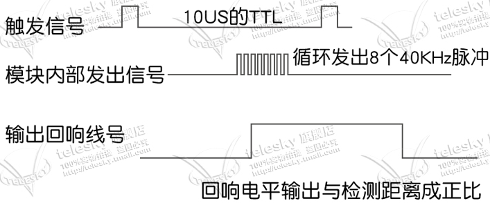
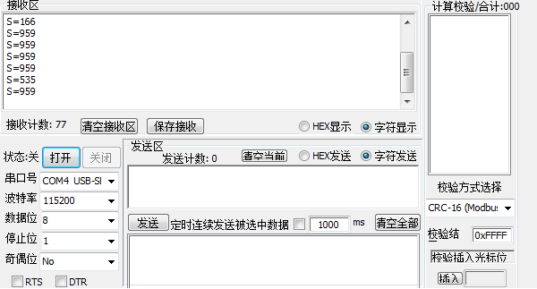

### 利用HC-SR04和51单片机制造超声波测距模块

>#### 硬件电路分析：
>
>1.HC-SR04一共有4个引脚，分别为VCC，GND，Trig，Echo。
>
>​	分别接入51单片机的VCC，GND，已经io口P1^0和P3^2;
>
>2.利用串口，将距离数据在电脑上用调试助手打印出来
>
>3.led点亮，提示系统正常运行
>
>#### HC-SR04相关知识：
>
>
>
>由图我们可以简而易的：
>
>**HC-SR04的工作原理：**
>
>1.采用IO口TRIG触发测距，给至少10us的高电平信号来启动模块。
>2.模块自动发送8个40khz的方波，自动检测是否有信号返回。
>3.如果有信号返回，通过IO口ECHO输出一个高电平，高电平持续的时间就是超声波从发射到返回的时间。通过公式计算测试距离=(高电平时间*声速(340M/S))/2
>
>即我们只需要提供一个 10uS 以上脉冲触发信号，该模块内部将
>发出 8 个 40kHz 周期电平并检测回波。一旦检测到有回波信号则输出回响信号。
>回响信号的脉冲宽度与所测的距离成正比。由此通过发射信号到收到的回响信号
>时间间隔可以计算得到距离。
>
>**距离公式公式：uS/58=厘米或者 uS/148=英寸；或是：距离=
>高电平时间*声速（340M/S）/2；建议测量周期为 60ms 以上，以防止发射信号对
>回响信号的影响。**
>
>#### 封装超声波相关函数：
>
>***示例将采用定时器0计算高电平时间***
>
>* 1.超声波的初始化只要将定时器0配置好，以及将Trig和Echo拉低即可
>
>void Time0_Init(void)			//定时器0配置函数
>{
>TMOD=0x01; 
>TH0=0;
>TL0=0;
>ET0=1; 
>TR0=1; 
>EA=1; 
>}
>
>切记
>
>void Time0(void) interrupt 1   //空的定时器0服务函数，没有可能会发生不知名的错误
>{
>}
>
>void ultrasonic_init(void)		//超声波初始化函数
>{
>	Time0_Init();
>	TRIG=0;
>	ECHO=0;
>}
>
>* 2.配置发射信号函数：将Trig拉高大于10us即可
>
>void StartModule(void) 			//开始模块，根据手册得知将TRIG拉高20us左右
> {
> 	TRIG = 1;
>	delay_10us(2);
>	TRIG = 0;
> }
>
>* 3.计算距离的函数
>
>计算距离的方式有很多种，示例只是其中一种
>
>其中的S是全局变量int S; （也可是float数，打印时使用%f）
>
>void Conut(void)                //计算距离的函数
>{	
>	unsigned int time;
>	time=TH0*256+TL0;
>	TH0=0;
>	TL0=0;
>	S=(time*1.7)/100;
>}
>
>* 4.检测信号是否产生，以及当产生时计算高电平时间的函数
>
>void ultrasonic_distance(void)		
>/* 检测是否有信号回来，有则进行计算，有信号返回，通过IO口ECHO输出一个高电平，
>   高电平持续的时间就是超声波从发射到返回的时间。通过公式计算测试距离=(高电平时间*声速(340M/S))/2  */
>{
>	StartModule();
>	while(!ECHO);
>	TR0=1;
>	while(ECHO);
>	TR0=0;
>	Conut();
>	TH0=0;
>	TL0=0;
>	delay(80);
>}
>
>~~~
>**有关超声波的相关函数封装完毕，在主函数进行调用即可**
>~~~
>
>#### 串口的配置
>
>串口的配置不进行过多描述，51单片机基础知识就有教，只有配置好相关寄存器即可在主函数使用
>
>串口发送以及接受的信息都存放在SBUF中
>
>void senddelay(unsigned long time)		//串口发送消息时的延迟函数
>{                 
>	int i = 0;
>	int j = 0;
>	for(i = 0;i<100;i++)
>	{
>		for(j = 0;j<time;j++);
>	}
>}	
>void initUart(void)						//串口初始化函数
>{
>	EA = 1;
>	ES = 1;
>	SCON = 0x40;
>	TH2 = 0xFF;
>	TL2 = 0xFD;
>	RCAP2H = 0xFF;
>	RCAP2L = 0xFD;
>	T2CON = 0x34;
>}
>void sendMes(char *p)					//发送消息函数
>{
>	while(*p!='\0'){
>	sendsingle(*p);
>	p++;
>	} 
>	 senddelay(100);
>}
>void sendsingle(char single)			//传递数值函数
>{ 		
>	SBUF=single;
>	while(TI!=1);
>	TI=0;
>}
>
>**只要在主函数中调用initUart（）进行串口初始化**
>
>**向串口打印信息时使用sprintf（）；和sendMes(buf);即可**
>
>***切记要将波特率设置成串口初始化时选用的波特率，示例中选用的波特率是115200***
>
>
>
>
>
>
>
>
>
>
>
>
>
>
>
>