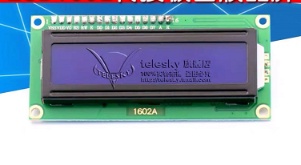
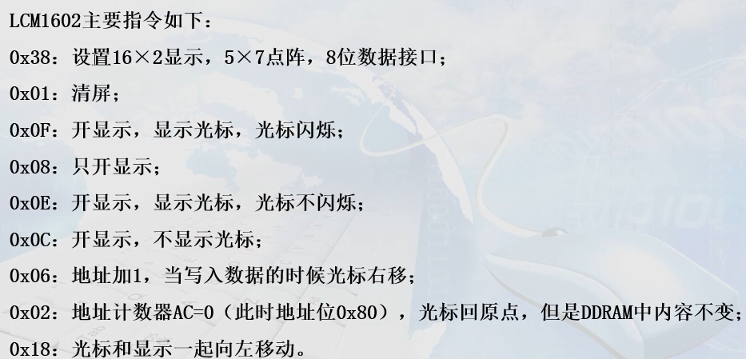
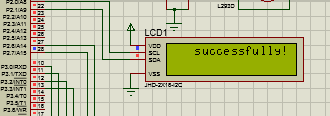

### 使用51单片机+lcd1602转接板-iic接口进行显示

>某宝上有卖lcd1602与iic芯片pcf8574的整合，虽然lcd1602能直接用51单片机使用，不过经过整合之后只需要对SCL和SDA两个io口进行操作即可，显得更轻松。
>
>
>
>#### 1.硬件电路分析：
>
>1.1：lcd1602与i2c模块的整合只有只有4个引脚，VCC，GND，SCL，SDA，分别接上单片机的VCC，GND，P2^0,P2^1;
>
>1.2:led点亮显示系统正常运行
>
>#### 2.配置i2c相关操作函数：
>
>查看其他博客
>
>#### 3.初始化lcd1602：
>
>对lcd1602进行初始，我们需要了解lcd1602的相关命令，对其传送命令才可令其初始化
>
>
>
>其中的0x38(设置显示模式)，0x01(清屏)，0x08（只显示）和0x0c（开显示，不显示光标）是初始化有使用到的。我们只要将这些命令传入lcd1602即可达到初始化的目的。
>
>**3.1. 传输数据：**前面有说，lcd1602整合模块是采用i2c方式进行通信的，所以要传输数据，就要对i2c进行配置
>
>**封装向lcd传输命令的函数：**
>
>void write_cmd(unsigned char cmd)                
>{       
>   I2cStart();                                                        
>   I2cSendByte(0x7c);                                        
>   I2cSendByte(0x80);                                        
>   I2cSendByte(cmd);
>        I2cStop();                                                               
>     }
>     
>     （其中的I2cStart(),I2cStop()与I2cSendByte(cmd)都是之前有说过的，很普通的i2c操作函数）
>     
>**有了传输命令的函数，就可以封装一个初始化的函数：**
>
>void lcd_init(void)                                        
>{
>   write_cmd(0X38);                                      
>   write_cmd(0x0c);                                        
>   write_cmd(0x01);                                        
>   delay_ms(2);                                                      
>     }
>     
>     （传输的数据对应lcd命令）
>     
>#### 4.封装lcd显示函数
>
>lcd1602的屏幕可以大概分为16*2，即是水平可以容纳16个字符，垂直分为2行
>
>通过传入不同的地址，即可让字符显示在屏幕的任意位置
>
>**4.1封装向lcd写入字符数据的函数：**
>
>要向显示字符，肯定要传入字符数据
>
>void write_data(unsigned char DData)
>{
>	I2cStart(); 
>	I2cSendByte(0x7c);
>	I2cSendByte(DData);
>	I2cSendByte(0x40);
>	I2cSendByte(DData);
>	I2cStop();
>}
>
>将字符数据通过DData传入函数内部，再在函数内部通过i2c操作函数向lcd传入数据
>
>**4.2 封装显示单字符的函数：**
>
>通过整合上一个函数，可以封装一个显示单字符的函数
>
>void dispaly(unsigned char X, unsigned char Y, unsigned char DData)
>{
>	Y&=0x1;
>	X&=0xF; 
>	if(Y) 
>	X|=0x40; 
>	X|=0x80;
>	write_cmd(X);
>	write_data(DData);
>}
>
>（X为要显示的水平距离，Y为要显示的垂直距离，DData为字符数据）
>
>**4.3 封装显示字符串的函数：**
>
>有了显示单字符的函数，还可以封装显示字符串的函数
>
>void dispaly_character(unsigned char X, unsigned char Y, unsigned char* Arry)
>{
>	unsigned int i;
>	unsigned int length=strlen(Arry);
>	for(i=0;i<length;i++)
>	{
>	dispaly(X,Y,Arry[i]);
>	X++;
>	if(X>16)
>	{Y+=1;X=0;}	
>	}
>}	
>
>（将字符串数组传入函数，X和Y决定字符串起始位置，当显示超过16个字符时自动换行）
>
>最后附上源码和效果图：
>
>~~~
>
>~~~
>
>