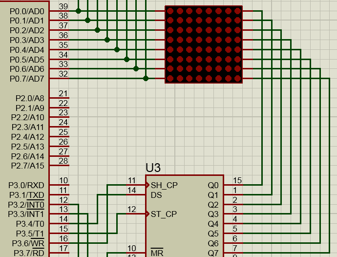
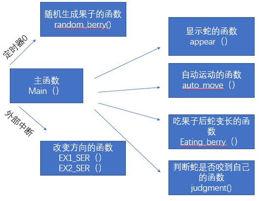
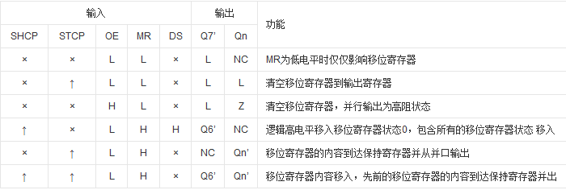
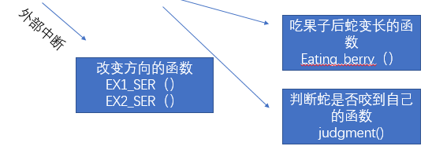

### 利用51单片机+hc595芯片配合在led点阵上玩贪吃蛇 第一篇“显示贪吃蛇”

>#### 硬件电路分析：
>
>* 1.采用51单片机和hc595芯片
>* 2.采用led点阵8*8
>* 3.hc595芯片的SER，SRCLK，RCLK分别接入单片机P3^4,P3^6,P3^5
>* 4.hc595芯片的Q0~Q7接入led点阵8*8的阳极段
>* led点阵8*8的阴极端接入单片机P0口（切记一定要分清哪边引脚是要输入高电平的，哪边引脚是要输入低电平）
>
>1
>
>**如果按照示例中的接线方式，我们不难发现，P0是控制led点阵的列，当其中一个io口（例P0^0）输出低电平，**
>
>**此时Q0~Q7都输出高电平，那么led点阵8*8第一列将全部点亮。如果只有其中一个io口（例Q0）输出高电平，**
>
>**那么就是第一列第一行的led点亮，可以理解为坐标（1，1）**
>
>**也就是说hc595的并行输出口Q0~Q7是控制led点阵的行的**
>
>### 函数结构分析
>
>					
>
>#### hc595相关操作函数
>
>>既然用到hc595，那么当然是对其三个与单片机相连的io口进行操作，从而使Q0~Q7可以输出高低电平
>
>>通过真值表可以知道具体操作：
>
>>#### 封装hc595传输数据函数
>
>>sbit SER= P3^4;    
>>sbit SRCLK=P3^6;    
>>sbit RCLK=P3^5;
>
>>`void HC_595(unsigned char date)				 
>>{	
>>	unsigned char i;
>>	SRCLK = 0;
>>	RCLK = 0;
>>	for(i=0;i<8;i++)
>>	{
>>		SER = date>>7;
>>		date<<=1;
>>		SRCLK = 1;
>>		_nop_();
>>		_nop_();
>>		SRCLK = 0;
>>	}
>>	RCLK = 1;
>>	_nop_();
>>	_nop_();
>>	RCLK = 0;
>>}`
>
>>(包含intrin.h函数库)
>
>#### 显示贪吃蛇
>
>>贪吃蛇的显示是这个程序的核心，虽然将led点亮很简单，一边输出一个低电平另一边输出一个高电平即可，但当考虑到后面的操作，简单的对其io口进行高低电平的输入输出显然会令后面程序的蛇会更加复杂。
>
>>我们可以将8*8led点阵看做是一个坐标系或者是一个表格，每一盏led灯都有其对应的位置，封装一个显示函数，向其传入需要点亮的led灯的x，y坐标，会更加简单，在后续的操作中，例如改变方向，只要改变led灯x，y坐标即可改变其方向。
>
>>`unsigned char code X_[8]={0x7F,0xBF,0xDF,0xEF,0xF7,0xFB,0xFD,0xFE};`	 
>>`unsigned char code Y_[8]={0x80,0x40,0x20,0x10,0x08,0x04,0x02,0x01};`  
>
>>`unsigned char x[32]={0},y[32]={0};`
>
>>**其中的x，y代表led的x，y坐标，X\_[8]对应着x，Y\_[8]对应着y，例如假设点亮（5，1）这个led灯，则X\_[5-1]，code Y_[1-1]，这两个值组合，即可点亮第五列第1盏灯
>
>>
>
>>#### 封装显示函数
>
>>unsigned char length=3;      length的数值取决于你开始点亮多上led灯，点亮3盏就填3。
>
>>开始点亮led灯直接往数组填入数值即可：
>
>>​	x[0] = 2;			   
>>​	y[0] = 3;
>>​	x[1] = 3;
>>​	y[1] = 3;
>>​	x[2] = 4;
>>​	y[2] = 3;
>
>>void appear(void){
>>	unsigned char i;
>>	P0=0xFF;		 
>>	HC_595(0x00);
>>	for(i=0;i<length;i++)					 
>>	{
>>		if((x[i]!=0)&&(y[i]!=0))
>>		{
>>			HC_595(Y_[y[i]-1]);
>>			P0=X_[x[i]-1];
>>			delay(5);		        
>>		}
>>	}
>>}
>
>>（delay函数为短暂延时，没有特别要求，示例是选择了我以前的程序中的ms延时）
>
>#### 显示浆果的函数
>
>>显示浆果的函数，比起显示贪吃蛇简单的多，我们只要满足一个条件即可，随机生成显示出来的浆果的berry_x,berry_y坐标不与贪吃蛇的x，y坐标重合即可
>
>>即：在生成随机数后判断一下是否与已经存在的x，y值相等，相等，则再次生成。
>
>>unsigned char berry_x;			
>>unsigned char berry_y;
>
>>void random_berry(void)						
>>{
>>	unsigned char i,random_x,random_y;		
>>	do{
>>		flag_repaeat=0;
>>		random_x=(rand()%8)+1;	   				
>>		random_y=(rand()%8)+1;
>>		for(i=0;i<length;i++)
>>		  {	
>>			if((random_x==x[i])&&(random_y==y[i]))	                     
>>					flag_repaeat = 1;		
>>		  }
>>		}while(flag_repaeat);		
>>	berry_x=random_x;
>>	berry_y=random_y;
>>}
>
>>（用random_x和random_y存储rand（）函数生成的随机数，再进行判断，满足条件则给赋给berry_x和berry_y）
>
>>**显示浆果的函数**：
>
>>显示浆果我选用了利用定时器进行显示，定时器每1ms进入中断一次，例如类似于显示贪吃蛇的方式显示出浆果，由于刷新速度很快，所以肉眼是看不出浆果led的闪烁的
>
>>void Timer0Init()				  
>>{
>>	TMOD|=0X01;
>>	TH0=(65536-1000)/256;	
>>	TL0=(65536-1000)/256;	
>>	ET0=1;
>>	EA=1;
>>	TR0=1;	
>>}
>
>>void Timer0(void) interrupt 1
>>{
>>	P0 = X_[berry_x-1];
>>	HC_595(Y_[berry_y-1]);
>>}

### 利用51单片机+hc595芯片配合在led点阵上玩贪吃蛇 第二篇“自动运行函数”

>贪吃蛇是自己不断朝着前运动的，所以需要封装一个令贪吃蛇自己朝前运动的函数
>
>#### 自动运行函数满足条件：
>
>* 1.控制贪吃蛇不断运动
>* 2.运动方向发生改变时，蛇头运动方向立马发生改变，蛇身其他led灯运动方向仍保持，待运动到蛇头未改变时的位置，方可改变运动方向
>* 3.改变运动方向后，贪吃蛇朝此方向向前
>
>虽然看上去十分混乱，一头雾水。
>
>**1.但我们先拆分出蛇头的坐标方位进行分析，起初我们自定义的蛇身长度为length（初始化点亮了三盏灯，length为3），贪吃蛇中led灯坐标都在x[32],y[32]数组里，那么蛇头的坐标对应着就是x[length-1],y[length-1].**
>
>**2.我们假设蛇头要向左移动一位，起初蛇头位置为（2，3），移动后就是（1，3），x-1，y-0；**
>
>**以此类推，向右就是x+1，y；向上就是x，y+1；向下就是x，y-1;**
>
>**3.将改变的数值用flag_x,flag_y表示，那么例如蛇头向左一位则就是**
>
>**flag_x=1,                       flag_y=0,**
>
>**x[[length-1]+flag_x],    y[[length-1]+flag_y]**
>
>**通过改变flag_x和flag_y的值，就可实现上下左右的移动。**
>
>**4.蛇头的运动有了，蛇身的运动怎么解决，其实十分简单，将蛇身的坐标点都换成它上一个点的坐标即可**
>
>**例如蛇头改变方向了，蛇头的下一led此时坐标改为蛇头为发生改变时的坐标，以此类推，往返操作，即可达到运动的目的**
>
>#### 封装自动运动的函数
>
>>void auto_move(void)		
>>{	
>>	unsigned char i;					
>>	for(i=0;i<(length-1);i++)
>>	{
>>		x[i]=x[i+1];
>>		y[i]=y[i+1];
>>	}
>>		x[length-1]+=flag_x;
>>		y[length-1]+=flag_y;
>>			if(x[length-1]>8)			
>>				x[length-1] = 1;
>>				else if(x[length-1]<1)
>>					x[length-1] = 8;				
>>			if(y[length-1]>8)
>>				y[length-1] = 1;
>>				else if(y[length-1]<1)
>>					y[length-1] = 8;
>>	delay(500);
>>}
>
>>（短暂延时，避免改变过快）
>

### 利用51单片机+hc595芯片配合在led点阵上玩贪吃蛇 第三篇“相关决策函数”

>我们需要的决策函数有哪些：
>
>
>
>#### 1.改变方向的函数
>
>改变方向示例中只采用了两个按键，因为贪吃蛇是不断朝某一方向运动的，那么相对于蛇运动的方向来看，其实只要两个可以改变的方式：要么向左，要么向右，没可能蛇头反转穿过蛇身运动的。
>
>因此既然我只用这两个按键，那么刚好能使用外部中断，当按下按键时，进入外部中断0或外部中断1
>
>进而根据逻辑判断，改变flag_x和flag_y的值，改变蛇的运动方向。
>
>**逻辑判断：**
>
>**贪吃蛇在平面上运动，将平面分为上下左右，假设当蛇向平面方向上的左运动，那么相对于这个运动方向的左手边即是平面方向的下，右手边即是平面方向上的上**
>
>**以此类推，只需要两个按键即可操作好蛇的运动方向**
>
>1.1外部中断配置;
>
>void EX_INIT()
>{
>	IT0=1;	
>	EX0=1;													  
>	IT1=1; 
>	EX1=1;	
>	EA =1;
>}
>
>中断服务函数：
>
>void EX1_SER(void) interrupt 0
>{
>	if(flag_y==1)      //up
>	{flag_x=-1;     //left
>	 flag_y=0;}
>	else if(flag_y==-1) //down
>	{flag_x=1;     //right
>	 flag_y=0;}	
>	else if(flag_x==-1) //left
>	{flag_x=0;		//down
>	flag_y=-1;}
>	else if(flag_x==1)   //right
>	{flag_x=0;			//up
>	flag_y=1;}
>}
>void EX2_SER(void) interrupt 2
>{
>	if(flag_y==1)	//up
>	{flag_x=1;     //right
>	 flag_y=0;}
>	else if(flag_y==-1) //down
>	{flag_x=-1;     //left
>	 flag_y=0;}
>	else if(flag_x==-1) //left
>	{flag_x=0;		//up
>	flag_y=1;}	
>	else if(flag_x==1)   //right
>	{flag_x=0;			//down			
>	flag_y=-1;}	
>}
>
>#### 2.吃果子后蛇变长的函数
>
>吃果子后蛇变长的函数需要做的事情只有三件：
>
>* 1. 判断有没有吃到果子
>
> 2. 吃到果子后蛇变长
>
> 3. 吃到果子后生成果子
>
>    >1.判断有没有吃到果子：
>    >
>    >吃到果子有两种情况：按下按键之后刚好吃到果子和蛇在自动运行过程中吃到果子。
>    >
>    >无论哪种情况，都是判断蛇头的x，y是否和果子的berry_x,berry_y是否相等，相等即视为吃到果子；
>    >
>    >当然，对于第一种情况，更准确的描述是按按键之后x+flag_x，y+flag_y和果子berry_x,berry_y相等。
>    >
>    >2.吃到果子后蛇变长：
>    >
>    >蛇变长可以看做将果子嵌入蛇头前一个位置：相关操作就是：
>    >
>    >原本蛇的长度length，吃到果子之后length++，
>    >
>    >此时x[length-1]，y[length-1]并未有数值，还只都是0，（length未自加前length-1指向蛇头）
>    >
>    >x[length-2]，y[length-2]指向蛇头
>    >
>    >因此将berry_x,berry_y的数值分别写入x[length-1]，y[length-1]
>    >
>    >就相当于将果子嵌入蛇头前一个位置。
>    >
>    >3.吃到果子后生成果子：直接调用随机生成果子的函数random_berry()即可
>
>    #### 封装吃果子后蛇变长的函数：
>
>    分析完，直接上一波代码：
>
>    void Eating_berry(void)			
>    {
>    	if(((x[length-1]+flag_x)==berry_x)&&((y[length-1]+flag_y)==berry_y)  )
>    					{flag_eating=1;}
>    	else if((x[length-1]==berry_x)&&(y[length-1]==berry_y))
>    					{flag_eating=1;}
>    	if(flag_eating)
>    	{
>    		flag_eating=0;
>    		TR0 = 0;
>    		length++;
>    		x[length-1]=berry_x+flag_x;
>    		y[length-1]=berry_y+flag_y;
>            random_berry();  
>    		TR0=1;
>    	}
>    }
>
>#### 3.判断蛇是否咬到自己的函数
>
>判断蛇是否咬到自己的条件与判断是否吃到果子是异曲同工之妙的。
>
>不过要注意的是，在蛇长度大于4之前，是无法咬到自己的蛇身的，因此我们可以从长度length>4开始判断。
>
>判断的条件是：蛇头是否与蛇身（贪吃蛇排在前3的led除外，可以假想一波，蛇头是无法咬到2，3盏灯的）的任意一盏led灯的坐标重合，如果重合，即是咬到自己了。
>
>代码很短：
>
>unsigned char flag_death=0;
>
>void judgment(void)
>{
>	unsigned char i;
>	if(length>4)	
>	{
>	for(i=0;i<length-4;i++)				   
>	  {	
>		if(((x[length-1])==x[i])&&((y[length-1])==y[i])  )  
>				 {
>					flag_death=1; 
>				 }
>	  }
>	if(flag_death==1)
>		{
>		led_g=~led_g;
>		}
>	}
>}
>
>if(flag_death==1)这是死亡之后的操作，可以自行设计，设计音效或者闪灯什么的都可。
>
>flag_death是死亡的标志，通过这个标志可以在蛇死亡之后主函数停止调用相关操作函数，游戏结束。
>
>主函数调用：
>
>int main()
>{
>	EX_INIT();
>	snake_init();
>	Timer0Init();
>	Timer1Init();
>	random_berry();
>	while(1)
>	{
>				  if(!flag_death)	  
>				    {
>						appear();
>						auto_move();		 	
>						Eating_berry();
>						judgment();
>					}
>		led=~led;
>	}
>}
>
>其中设计的所以函数都分析完毕，虽然功能实现的十分粗糙，但各位可以根据自行需要进行更多的设计。