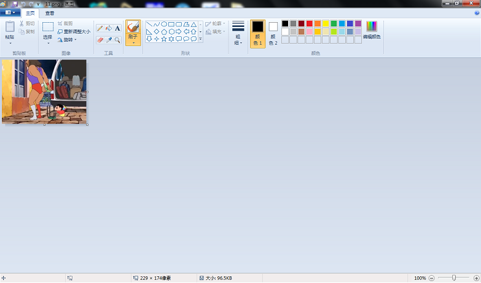
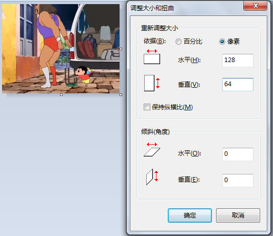
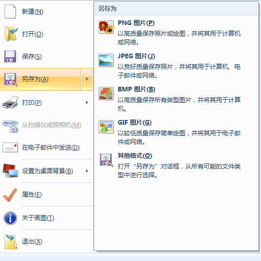
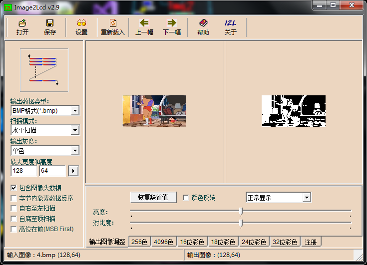
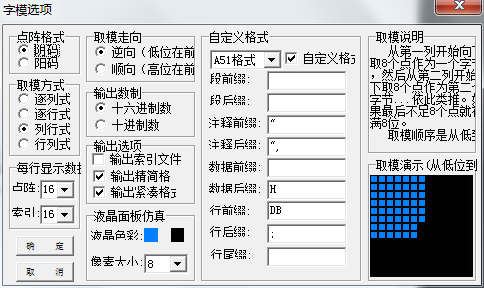
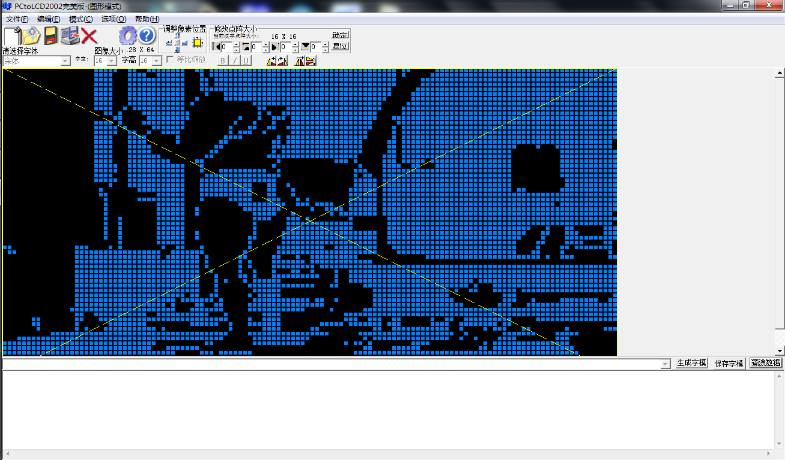

### 利用51单片机+0.96寸iic接口oled显示图片或动图

>#### 前言：之前讲过如何使用oled显示数字以及字符，但并未讲述如何显示BMP格式的图片，
>
>#### 这篇将在之前的基础上加以封装一些函数用来显示图片
>
>#### 硬件电路：
>
>* 1.led接51单片机的P2^0,点亮led用来提示系统正常运行中
>* 2.oled共VCC，GND，SCL，SDA四个引脚分别接入单片机VCC，GND，P1^7，P1^6。
>
>#### 1.封装iic操作函数：
>
>用到的iic操作函数：
>
>1.1 起始时序：void I2cStart(void);
>
>1.2 终止时序：void I2cStop(void);
>
>1.3 iic写入一字节数据：unsigned char I2cSendByte(unsigned char dat);
>
>***上面链接有详细的iic操作函数的封装分析，以及下面oled操作函数封装的分析***
>
>#### 2.封装oled操作函数：
>
>用到的oled操作函数：
>
>2.1 oled写命令：void oled_Write_cmd(unsigned char cmd);
>
>2.2 oled写数据：void oled_Write_data(unsigned char dat);
>
>2.3 oled清屏函数：void oled_clear(void);
>
>2.4 oled初始化函数：void oled_initial(void);
>
>#### 3.封装显示图片的操作函数：
>
>3.1 设立图片显示位置的函数： void oled_setpos(unsigned char x,unsigned char y);
>
>3.2 图片显示函数：void oled_showpictues(unsigned char x0,unsigned char y0,unsigned char x1,unsigned char y1,unsigned char BMP[]);
>
>其中设立图片显示位置的函数oled_setpos已经包含在图片显示函数 oled_showpictues中，我们只要在主函数中调用oled_showpictues即可；
>
>其中x0，y0为初始坐标:一般为（0，0）
>
>x1，y1为终止坐标：可以看做是取模的图片的大小;一般填入（128，64）或者（64，64）
>
>**(由于0.96oled的分辨率为128\*64，所以取模方式主要有两种：64\*64和128\*64，分别是半屏显示和全屏显示)**
>
>图片1（这是半屏显示）
>
>unsigned char y1,unsigned char BMP[]是取模出来得图片数据。
>
>#### 4.图片取模
>
>##### 4.1 修改图片的格式以及大小：
>
>例：
>
>选择一张图片右键选择打开方式→以画图方式打开→重新调整大小（选项在大概左上角位置）→点击像素→取消勾选保持纵横比→修改宽高为128\*64或者为64\*64；
>
>图片
>
>最后选择另存为→以bmp格式保存。
>
>
>
>#### 4.2 利用Img2Lcd.exe将以上修改好的bmp图片进一步转换为二值化图片
>
>
>
>**注意如果你的图片格式大小是128\*64，软件中就要选择128\*64，如果是64\*64，则为64\*64，然后通过调节亮度和对比度是图片更清晰**
>
>#### 4.3 利用取模工具PCtoLCD2002.exe将图片数据取模出来
>
>**打开软件时点击模式选择选择图片模式，点击选项配置成下图**
>
>
>
>然后打开Img2Lcd.exe生成的bmp图片
>
>
>
>点击生成字模，将字模数据复制进数组即可。
>